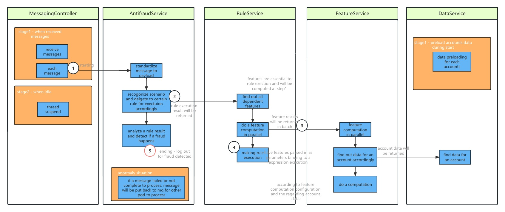

# hsbcAntifraud

used only for hsbc examination purpose

## features/functions introduction
refers to 

* A rule, which can be configured and executed for a certain rule based on features, for example, is it a suspicious login (rule2)
* A feature/variable, which can be configured and executed for a certain feature based on user data, for example, how many failed login attempts an account tried (xIllegalLogins)
* A data, which simulates and mocks data which will be used for feature computation
* support for antifraud detecting & message processing, which process messages/payloads and gives fraud alert & logs 

## arch & docs
* logical arch regarding  
* a sequence diagram which demonstrates a major flow of execution   

## code structure & modules

* antifraud-web module, it provides messaging and web related functions, also configurations and tests are within
* antifraud-service module, it provides all antifraud related services and all regarding utils, model, etc

## tests 
all tests are under antifraud-web/src/test/java/...; 
tests can be run in either idea or triggered by a maven build

### the unit test regarding each major feature and modules
* FeatureTest
* RuleTest
* EnvTest, it is regarding environtment settings
* MessagingTest, it is regarding messaging send & receiving to ali-cloud

### the integration test
* AntifraudTest
  * testIntegration1 is an integration test in a non-message way, which can be run locally
  * testIntegration2 is an integration test in a message way, which is sent to mq and all nodes can consume messages and do fraud detects

### test report and coverage
 - this project uses surefire and jacco, in which test results will be output under antifraud-web/target/site/jacco-aggregate/index.html
 - following is a test coverage report generated by jacco

## deployments
it is deployed on ali-cloud ack 

 - it is in a mirror way to deploy ack env
 - the deployment details can be viewed in either Dockerfile & center.yaml
 - the system also used https://devops.aliyun.com/ in a flow to deploy the deployable

### access aliyun using following account 

    -  using a subaccount to login ack env
        + https://signin.aliyun.com/   choose to use subaccount login
        + loginname and password is ->    interviewer@1712034974828389.onaliyun.com        ape@1234
        + shall bind a mobile in order to login
    -  login url -> csnew.console.aliyun.com
    -  then shall able to login and see this screen below 
    -  application nodes can be accessed through 工作负载>>无状态>>hsbc-antifraud-test 
    -  hpa settngs are under 工作负载>>无状态>>hsbc-antifraud-test>>容器伸缩
    -  mq using mns, can reach through following https://mns.console.aliyun.com/region/cn-hangzhou/queue/antifraud/detail
    -  logs are under 运维管理>>日志中心>>应用日志, an example is shown below
    

    

## dependencies
in order to run this u need to have following criteria
- jdk8 
- maven 
- springboot
